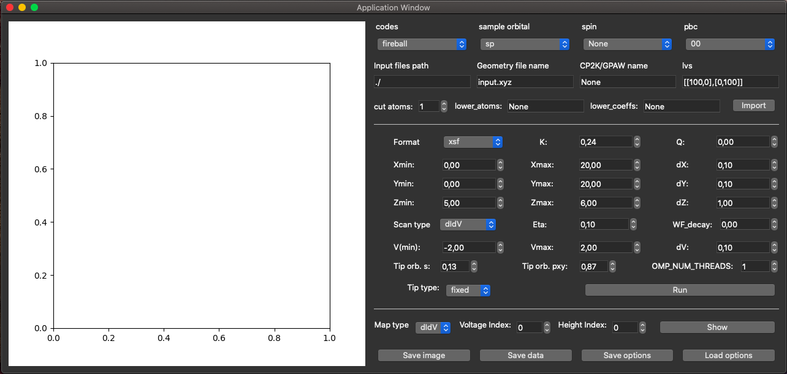
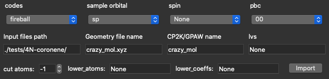
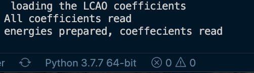
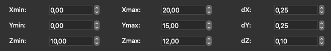
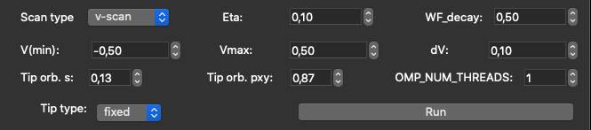
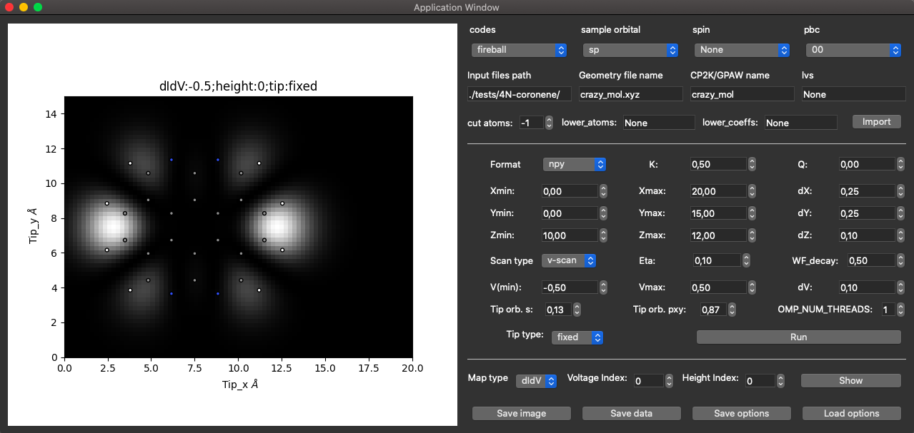
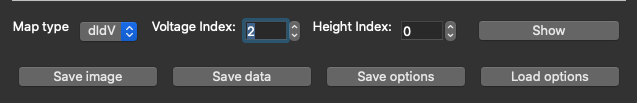
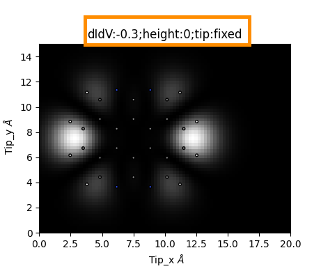
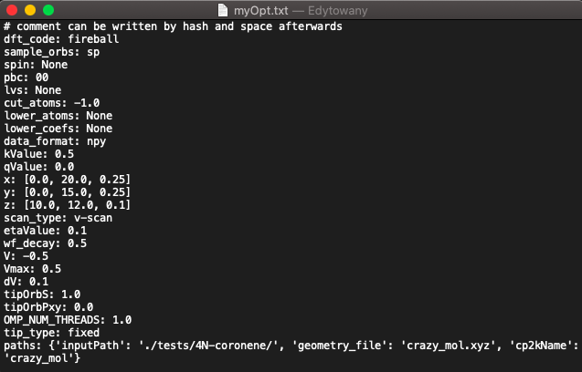

# Probe Particle Scanning Tunnelling Microscopy (PPSTM) simulation package:

## Compilation and overview:

Written in Python 3 (operating language)/C++ (heavy machinery, via C_types) or optionally Python/OpenCL for run on graphics card. The later option works only for one example and is under (sleeping) development.

2 OS compilations working and tested:
- Linux -- compilation should work automatically with usage of _g++_ compiler
- MAC   -- OS set automatically, _g++-9_ set as default; adapt your makefile in **cpp/** folder and/or your (MCC) compiler using [this](https://github.com/ProkopHapala/ProbeParticleModel/wiki/MAC-Users).
- Windows not tested, please [contact](https://github.com/ondrejkrejci/PPSTM/wiki#contact) us, if you run into problems.

Serial or OpenMP parallelisation:
- Decided automatically depending on the system `OMP_NUM_THREADS` variable -- if it is _1_, or _not set_, then serial ; otherwise OpenMP.
- Code is compiled each time it is run,   

Makefile is in **cpp/** folder.

GUI for more user friendly exeperience:
- In order to run the interface, clone the repository using:
`> git clone https://github.com/ondrejkrejci/PPSTM.git`
- And follow the instructions from the full descrtipion of [GUI](https://github.com/ondrejkrejci/PPSTM/wiki#GUI-for-PPSTM-code)

### Software requirements

- `Python 3.7` with following packages:`Numpy`, `matplotlib` and `PyQt5`(for GUI)

## Developers:

Mainly developed at: [Nanosurf Group, Institute of Physics of the Czech Academy of Sciences, Czech Republic](https://nanosurf.fzu.cz) and [SIN group, Aalto University, Finland](https://www.aalto.fi/en/department-of-applied-physics/surfaces-and-interfaces-at-the-nanoscale-sin); with help from: [Nanotech@surface Laboratory, EMPA, Switzerland](https://www.empa.ch/web/s205).

## Literature:

The structure of the code and how it works is explained mainly in the literature: 

- __Main principle of **STM** and **dI/dV** calculations:__ Ondrej Krejčí, Prokop Hapala, Martin Ondráček, and Pavel Jelínek, Principles and simulations of high-resolution STM imaging with a flexible tip apex, Phys. Rev. B 95, 045407 – Published 6 January 2017 [[https://journals.aps.org/prb/abstract/10.1103/PhysRevB.95.045407]]

- __Main principle of **IETS** calculations and usage of **d**-sample orbitals:__ Bruno de la Torre, Martin Švec, Giuseppe Foti, Ondřej Krejčí, Prokop Hapala, Aran Garcia-Lekue, Thomas Frederiksen, Radek Zbořil, Andres Arnau, Héctor Vázquez, and Pavel Jelínek, Submolecular Resolution by Variation of the Inelastic Electron Tunneling Spectroscopy Amplitude and its Relation to the AFM/STM Signal, Phys. Rev. Lett. 119, 166001 – Published 16 October 2017 [[https://journals.aps.org/prl/abstract/10.1103/PhysRevLett.119.166001]]

- __More detailed description in a thesis of Ondřej Krejčí: DFT simulations of interaction of organic molecules with oriented surfaces , chapters 4 and 8. They also contain the original papers:__ [[https://dspace.cuni.cz/bitstream/handle/20.500.11956/94029/IPTX_2013_1_11320_0_423251_0_142561.pdf?sequence=1&isAllowed=y]]

- __WIKI pages of the NANOSURF group (IOP ASCR) containing examples, tests and description of the (input) files and some procedures:__ [[https://nanosurf.fzu.cz/wiki/doku.php?id=probe_particle_stm]]

- __For simulations of images obtained with flexible tip apexes please read about the Probe Particle Model (PP-AFM), whose calculations are necessary for these types of simulations:__ [[https://github.com/ProkopHapala/ProbeParticleModel/wiki]] and [[https://nanosurf.fzu.cz/wiki/doku.php?id=probe_particle_model]]

For the runs with flexible tip apexes and for storing in _xsf_ and _npy_ format it is important to have linked PP-AFM code as **PPAFM** symbolic link in your **PPSTM** directory and **pyProbeParticle** , too. You can easily do it by running: _install_PPAFM.sh_ .

## PPSTM_simple.py

### Overview:

- Fully automatic (closed) python script for STM and/or dIdV calculations with _stiff_ single atom or _flexible_ tip-apex for calculations of systems on metallic/semiconductor substrates for sample biases between (-2,+2) volts:

You can copy this script to directory with your (DFT and/or PP-AFM) pre-calculations, set properly _ppstm_path_ to your PPSTM code (DO NOT USE  `$HOME`  for the path, still both absolute or relative is working) and you can run the script in the folder. Later you will have a possibility to see what options you used for the calculations.

The first part of the script contains variables that you can change, so the code would do, what you want. There is an brief explanation for each variable  at the end of the line in comments. The script should be self-explaining.

All the Voltages are defined with respect to the sample (positive ~ empty states, negative ~ filled states) and the Fermi Level.

### DFT codes inputs:

The script can handle DFT inputs pre-calculated from _Fireball_, _CP2K_, _FHI-AIMS_ and _GPAW_ (in LCAO mode) codes. How to prepare those inputs is explained here: [[https://nanosurf.fzu.cz/wiki/doku.php?id=creating_inputs]] . The script was tested for first three DFT-codes (fell free to test GPAW, but it has known problems for handling _d_ orbitals on the sample and if any Hydrogens are not at the end of contributing atoms).

For _CP2K_ and _FHI-AIMS_ spin-polarized calculations can be handled as well. You can choose  >> alpha <<  =  >> up <<  spin,  >> beta <<  =  >> down <<  spin or  >> both <<  spins contributing to your current.

### Types of calculations/scans:

__didv__ - single dI/dV (conductance) calculation at the energy (relative to the Fermi Level) given by _V_ .

__USE >>V-scan<< instead of >>STM<<:__ __>>STM<<__ is calculated via _rectangular integration_ = _SUM_ of single _dIdV_ for a single voltages between required voltage and zero. At the end it gives you a data for a single voltage _V-scan_, on the other hand, is basically calculating all _dIdVs_ between Vmin and Vmax ( Vmin<=0<=Vmax ), then calculates _STMs_ and gives you all of them. You'll therefore have everything between Vmin and Vmax in a single run. If an experimentalist asks you about an image on 1.5 V I would perform V-scan between 0 and 2 V and then looked at the image and compare -- it is possible, that either gap, either the Farmi Level either some state is at wrong energy from your DFT calculations and therefore better STM image can be found on slightly different voltage. (Finally if you want to go over +-2V you have to adjust your cut_min and cut_max accordingly and especially in positive voltage pray, that your God of DFT makes your electronic structure of empty states far above the Fermi Level reasonable.)

__For molecules: New feature >>states<<__ : it will make a dI/dV calculations just for such Voltages, that corresponds to the eigen energies (states = ei) of the sample, which are within V <= ei <= Vmax . You do not need to specify those eigen energies by yourself; the script finds them by itself. Beware that still all the states are taken into account for the dI/dV calculations. If you want to use just 1 state, choose very low eta (e.g. 0.0000001).
 
### Periodic Boundary Conditions: 

Various Periodic Boundary Conditions (PBC) can be used, but beware:

_i)_ the script cannot use multiple _k-points_ (it can read only _Gamma_ _k_-point data), therefore that used supercell has to be big enough so the _Gamma_ point will describe the electronic state of your sample properly.

_ii)_ The script do not fold the scanning points into the original cell, therefore you can (sometimes) find the >> ends << of your geometry with >> boundary effects << taking place there. If electronic structure is right (!), those effect cannot penetrate inside into the inner part of the original super cell, but they affect couple of Å nearby the end of geometry.  

_iii)_ If electronic structure is OK you can: a) enlarge the amount of multiplied cells and use the inner part only (possible with the PPSTM_simply.py script). Or b) come up with procedure that will fold the positions into the original supercell (not written yet, one of the TODO goals).

### Meaning of sample orbitals:

Orbitals of the sample are not directly connected with used _LCAO basis-set_ of your DFT calculations. Even though you can use very big basis set for any element, the __PPSTM code__ uses only _valence_ orbitals. Therefore you can use only _sp_ sample orbitals, if your top-most atoms (those which are contributing to the current) are up to 3rd period of elements (even though i.e. you are using _spd_ basis-set orbitals in __Fireball__.) Since _d_ orbitals of the sample decays to the vacuum faster, than _sp_ orbitals, they are >> dampened << using constant rescaling of 0.2. (The factor is taken from comparison of _FHI-AIMS_ _s_ and _d_ orbitals  in the far away. The rescaling is not ideal, but different DFT codes uses different decays for various elements, therefore we found no other simple general rule within philosophy of this code.) Usage of _sp_ orbitals is 2x faster than _spd_ and more tip-atom orbitals are programmed. You can also investigate the difference between _sp_ and _spd_ via comparing tip_orb =  >> s <<  dIdV scans for a single height in your calculations.

### Advanced features:

_cut_atoms_ option can be use for (considerably) speeding up the calculations (,especially for thick slabs and high _pbc_ options). In most cases you can cut-out all the atoms that are 3 Å bellow the top-most (current-important) atom. (By current important, we mean anything that has considerable states on it. I.e. Hydrogens on the flat organic structures has probably much lower contributions than C atoms, then the C atoms counts). Or sometimes hydrocarbons on silicon can has much lower contributions than Si adatoms, then the Si adatoms counts.)

If you have high-electro negativity differences in between atoms contributing to the current __always__ check Hartree potential above these atoms. If big changes of the potential above your top-most atoms appear, try to estimate _lower_atoms_ and_lower_coefs_ (rescaling for highly electro-negative atoms). E.g. for O in carbonyl group of TOAT molecule, the oxygens the _lower_coefs_ were set to _0.5_ ( PRB 95, 045407 (2017) ).

### Outputs:

Outputs can be in:
- _grayscale_ __png__ images -- 2D for each height.
- WSxM __xyz__ files -- 2D for each height.
- 3D __XSF__ files with full stack of data.
- 3D machine readable __npy__ files with full stack of data.

Outputs can be for different heights, voltages, scanning techniques (STM or dIdV) and tip-atom orbitals:

### Tip model and its orbitals:

Tip-atom orbitals are: _s_, _px_ and _py_, _pz_, _dz2_, _dxz_ and _dyz_. The two last options works only for _sp_ orbitals of the sample, while the first three are working with both _sp_ and _spd_ orbitals of the sample.

_s_ tip-atom orbital works almost as _Tersoff-Hamann_ theory (PRL 50, 1998 (1983) ) -- it goes beyond this theory, since it takes into account interference effects (as e.g. in ACS Nano 9 (9), pp 9180–9187 (2015) ).

We do not calculate the current for any DFT calculated tip-model. We rather opt for calculations with different tip-atom orbitals and comparison with experiment. For calculations with CO-tip which can be anything between _s_ and _pxy_ tip-atom orbital, depending on sample-bias, tip-base element and structure (from PRL 107, 086101 (2011) -- 50/50 _s/pxy_ -- to PRB 95, 045407 (2017) -- 100% _pxy_ tip) you can try some options like >>spxy<< (50/50), >>CO<< (13/87 -- PRL 119, 166001 (2017) ), >>10spxy<< (10/90), >>5spxy<< (5/95), __but__ better is to calculate _s_ and _pxy_ in two separated runs and save it as __npy__ or __xsf__. Then you can use __SUM_Orb_Contrib.py__ script to print you any configurations between _s_ and _pxy_ tip-atom orbitals. This is possible, since contributions from different tip-atom orbitals can be simply summed-up. 

All the >>fixed<< scans are _constant-height_ scans. Those should be done ~ 4 - 6 Å above the highest atom of the sample. To run a single-height scan use: [zmin, zmax>zmax+dz, dz]. For the _constant-current_ scans there is no inner procedure. You can try to run scan for at least 2 Å heights with dz between 0.1 and 0.2, save it as __xsf__ and plot it in VESTA ([[http://jp-minerals.org/vesta/en/]]) or some similar software. __But__ before you do this try to run a single _constant-height_ scan if your simulations are similar to the experiment. Unless there is some crazy behavior with contrast reverse depending on height, there is no probable way that _constant-current_ simulation would differ a lot from the _constant-height_ one. Also, since __I__ or __dIdV__ ~ _Exp(-beta z)_ you can try to plot the images in a log-scale (Not programmed in __PPSTM_simple.py__, you can use WSXM for that) to emulate the _constant-current_ scan. 

### Atoms model plotting:

You can plot the position of atoms into the __png__ figures and into the __xsf__ files, if you have geometry, which you want to plot in an __input_plot.xyz__ file. It can be >>bas<< geometry, or it can be >>xyz<< geometry with __a single empty line__ bellow the amount of atoms in the file. 

## GUI for PPSTM code

### USAGE

After cloning the repository and [compilation](https://github.com/ondrejkrejci/PPSTM/wiki#compilation-and-overview): 

- Go to PPSTM directory
- run `> python GUI.py`

Following interface should appear:

  
    

### EXAMPLE

In the PPSTM/tests/ directory you can find folders with testing data e.g.`4N-coronene`.
Inside the test folder you will find the already saved GUI options for this test: _4nCoroneneOpt.txt_

- Now, having GUI in front of you, click `Load options`, go to the test's directory and choose _.txt_ file with options. Everything is pre-set and should run without bugs

- After loading the options, click `Import` button. Wait for the terminal to say _energies prepared, coeffecients read_

- Now click `Run`

You've successfully run the simulation and plotted the image.

Below you will find more detailed description of each GUI section with the instructions.

### INPUT PART

Give requiered input parameters. All the fields in this section are necessary.

  - `codes` ~ You can choose form `Fireball`, `FHI-AIMS`, `CP2K` and `GPAW`

  - `sample orbital` ~ either `sp` or `spd`

  - `spin` ~ none for spin-polarized calculations; up, down or both for spin-polarized calculations

  - `pbc` ~ Affects only calculations of L-J poetential. The code is always periodic from the nature of its design: PBC False means nPBC 0 0 0 ; PBC True means read nPBC parameter

  - `lvs` ~ 2D lattice vectors, works as 2D array or a file e.g. _input.lvs_

  - Give `Input files path` which is a path to your directory with necessary data: DFT pre-calculated eigen-energies and eigen-vectors and geometry

  - Give the name of `geometry file`, together with extension e.g. `input.xyz.`
    
  - Give CP2K/GPAW ~ name used in CP2K or GPAW calculations

  - `cut_at` ~ number of atoms that contribute to the tunneling (-1 = all atoms)

  - `lower_atoms` ~ works as 1D array of integers; [] = _None_ means that no atoms has lowered hopping; Be aware that python numbering occurs here: \[0] -- means lowering of the 1st atom; \[0,1,2,3] -- lowering of 1st 4 atoms

  - `lower_coefs` ~ works as 1D array of floats; [] = _None_ means that no lowering of the hoppings; \[0.5] -- lowering of the 1st atom hopping to 0.5; \[0.5,0.5,0.5,0.5] -- lowering of 1st 4 atoms to 0.5

Now click `Import` ~ without importing, you won't be able to run the program.
    
If everything went correct, last line of the output should print: `energies prepared, coeffecients read`

  
  

### RUNNING OPTIONS PART

- 1st line: _format_, _K_, _Q_

  

  Those parameters are used for relaxed scan (i.e. tip type = relaxed) for which you need to have pre-calculated tip-positions in `Kx.xxQx.xx/PPpos_*.xsf or .npy`  files. 

  `Format` ~ choose if you need tip-positions as `.xsf` or `.npy` files

  `K` ~ radial stiffness 

  `Q` ~ charge

  Both Q and K are used for PPAFM calculations.

- Following 3 lines of parameters are necessary for creating rectangular cuboid grid.  0, 0, 0 is the beginning of the eucleid system. The height of the scan should be about 4-6 Å above the heighest atom of your system

  

- Next 3 lines consist of parameters for the simulation
  
  
  
  `Scan type` ~ there are 3 options: `didv`, `states` and `v-scan`. The default `v-scan` is preferred, since it allows you to see all didv and STM maps for <V,0> interval. `states`  are useful for molecular systems - gives all dIdV maps for at energies of all eigenstates in between Vmin and Vmax . `didv`  calculates a single dIdV map at the energy of V.

  `Eta` ~ Width of the Lorentzian function for energy smearing. Deppending on system it can reach various values: for single molecular orbital very low number – 1e-6 eV; For standard slabs – 0.05-0.1 eV; For low layered or small slabs – 0.3-0.5 eV

  `WF_decay` ~ Describes how the Workfunction (barrier and therefore tunneling decay) is changing with increasing/decreasing voltage for each dI/dV step; 1.0 – the change of the tunneling decay scales with the voltage (at V=1.0 is WF=4.0 eV); 0.0 – no change with the voltage
  
  `V(min), Vmax` ~ aplied sample bias = (energy vs. the Fermi Level in eV)

  `dv` ~ It's a step between single dIdV calculations in case of V-scan. dV~eta

  `tip orb s` ~ contribution to the tunneling to/from s orbital on the PP

  `tip orb pxy` ~ contribution to the tunneling to/from non-tilting px and py orbitals on the PP (`px contribution = py contribution = tip orb pxy /2`)

  `OMP_NUM_THREADS` ~ number of cpu cores for OMP paralelization: ncpu = 1 -- serial compilation & calculations; if ncpu > 1, then OMP paralel recompilation is used and C++ calculations are running on more cores

  `Tip type` ~ _fixed_/_relaxed_, corresponds to fixed or relaxed scan

- Now click `Run`

The main part of PPSTM code will run and the program will plot the first image. (By default it is: `didv`, `height:0` , `voltage: 0`. You can change that before clicking `Run` if you want)

  

### PLOTTING PART

You can now change the plotted map with the following steps:
        
- choose `map type`: _STM_ / _didv_
  
  _STM_ is only available if the scan type was chosen to be _v-scan_

- choose `height` and `voltage` index

  Voltage index corresponds to different voltages if scan type was chosen to be _v-scan_ or _states_

- Now click `Show`

  

You will see that the title of the plot changed to display your chosen map parameters

  

You can now save the image or the calculated data with the `save image` and `save data` buttons respectively:

- After clicking the button, in both cases the saving file window will pop up
- You can save the image as `.png` file
- In order to save the data, you can choose `.xsf`, `.npy` or `.xyz` extension for it
- By default, in both cases the name of the saved file consists of data such as: _map type_, _tip type_, _WF value_, _eta value_, _height_ and _voltage index_

In order to save your chosen parameters (from both input part and running options part) you can click `save options` button

- The options will be saved as `.txt` file with each parameter listed on a new line. You can write your comments into this file by making a new line and beginning a comment with `#`

  

`Load options` button lets you load those saved options back into the GUI. After clicking it, the file browser will pop up. You just need to select the file with your saved options and click enter.

### RELAXED SCAN

In order to run relaxed scan you need to install PPAFM code.
Make sure you are in PPSTM directory and run:

`> ./install_PPAFM.sh`

If you needed before to change the compiler inside Makefile, you need to do it again inside PPAFM directory. Again, in `PPAFM/cpp/Makefile`, change `g++` to `g++-9/g++-10`, depending on your installed compiler.

### ADVANCED OPTIONS

If you require to change other parameters, you can inspect them inside pyPPSTM/guiMethods.py

__Functions inside guiMethods.py:__

- `imported()` ~ code inside this function runs when you click import button

- `newPPSTM_simple()` ~ this corresponds to button Run and it calculates the main results

## TODO :
_(but I will probably not have time to do it any time soon. Please send me a message if something would be interesting for you, I can try to speed it up.)_

- Reading input files from _VASP_, _SIESTA_, ???
- add _d_ vs. _spd_ orbitals (tip vs. sample).
- control and update reading procedure for _GPAW_
- program (and test) _pd_ tip-atom orbitals for the OpenCL run on GPU.
- automatic lowering of coefficients from __xsf__ or __cube__ files.

## Contact:

ondrej(dot)krejci(at)aalto(dot)fi

Source: https://github.com/ondrejkrejci/PPSTM/wiki