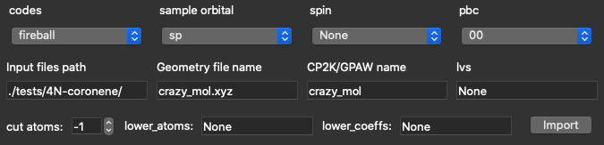
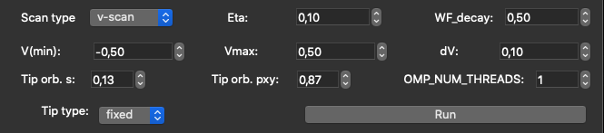
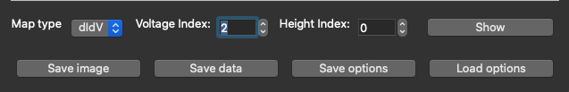

# PPSTM (Probe Particle STM)
Code simulating various various STM techniques, especially for [tilting tips](https://pubs.acs.org/doi/10.1021/ja204624g) (depending on [ProkopHapala/ProbeParticleModel](https://github.com/ProkopHapala/ProbeParticleModel) )
This is implementation of efficient and simple model for simulation of High-resolution scanning tunneling microscopy (STM).
Normall STM simulations using [Chen's approximattion](https://journals.aps.org/prb/abstract/10.1103/PhysRevB.42.8841) is part of the code as well

Documentation is at http://nanosurf.fzu.cz/wiki/doku.php?id=probe_particle_stm and here at Wiki: https://github.com/ondrejkrejci/PPSTM/wiki .

It can also simulate IETS images of molecules, if the imaging mechanism is driven by the amplitude of the IETS peak.

### References (STM)
* [Ondrej Krejčí, Prokop Hapala, Martin Ondráček, and Pavel Jelínek, Principles and simulations of high-resolution STM imaging with a flexible tip apex, Phys. Rev. B 95, 045407 – Published 6 January 2017 ](https://journals.aps.org/prb/abstract/10.1103/PhysRevB.95.045407) 

### References (IETS & STM-d orbitals)
* [Bruno de la Torre, Martin Švec, Giuseppe Foti, Ondřej Krejčí, Prokop Hapala, Aran Garcia-Lekue, Thomas Frederiksen, Radek Zbořil, Andres Arnau, Héctor Vázquez, and Pavel Jelínek, Submolecular Resolution by Variation of the Inelastic Electron Tunneling Spectroscopy Amplitude and its Relation to the AFM/STM Signal, Phys. Rev. Lett. 119, 166001 – Published 16 October 2017](https://journals.aps.org/prl/abstract/10.1103/PhysRevLett.119.166001)

# My Task

## GUI for PPSTM code

### USAGE

After cloning the repository and [compilation](https://github.com/ondrejkrejci/PPSTM/wiki#compilation-and-overview): 

- Go to PPSTM directory
- run `> python GUI.py`

Following interface should appear:

  
    

### EXAMPLE

In the PPSTM/tests/ directory you can find folders with testing data e.g.`4N-coronene`.
Inside the test folder you will find the already saved GUI options for this test: _4nCoroneneOpt.txt_

- Now, having GUI in front of you, click `Load options`, go to the test's directory and choose _.txt_ file with options. Everything is pre-set and should run without bugs

- After loading the options, click `Import` button. Wait for the terminal to say _energies prepared, coeffecients read_

- Now click `Run`

You've successfully run the simulation and plotted the image.

Below you will find more detailed description of each GUI section with the instructions.

### INPUT PART

Give requiered input parameters. All the fields in this section are necessary.

  - `codes` ~ You can choose form `Fireball`, `FHI-AIMS`, `CP2K` and `GPAW`

  - `sample orbital` ~ either `sp` or `spd`

  - `spin` ~ none for spin-polarized calculations; up, down or both for spin-polarized calculations

  - `pbc` ~ Affects only calculations of L-J poetential. The code is always periodic from the nature of its design: PBC False means nPBC 0 0 0 ; PBC True means read nPBC parameter

  - `lvs` ~ 2D lattice vectors, works as 2D array or a file e.g. _input.lvs_

  - Give `Input files path` which is a path to your directory with necessary data: DFT pre-calculated eigen-energies and eigen-vectors and geometry

  - Give the name of `geometry file`, together with extension e.g. `input.xyz.`
    
  - Give CP2K/GPAW ~ name used in CP2K or GPAW calculations

  - `cut_at` ~ number of atoms that contribute to the tunneling (-1 = all atoms)

  - `lower_atoms` ~ works as 1D array of integers; [] = _None_ means that no atoms has lowered hopping; Be aware that python numbering occurs here: \[0] -- means lowering of the 1st atom; \[0,1,2,3] -- lowering of 1st 4 atoms

  - `lower_coefs` ~ works as 1D array of floats; [] = _None_ means that no lowering of the hoppings; \[0.5] -- lowering of the 1st atom hopping to 0.5; \[0.5,0.5,0.5,0.5] -- lowering of 1st 4 atoms to 0.5

Now click `Import` ~ without importing, you won't be able to run the program.
    
If everything went correct, last line of the output should print: `energies prepared, coeffecients read`

  
  

### RUNNING OPTIONS PART

- 1st line: _format_, _K_, _Q_

  

  Those parameters are used for relaxed scan (i.e. tip type = relaxed) for which you need to have pre-calculated tip-positions in `Kx.xxQx.xx/PPpos_*.xsf or .npy`  files. 

  `Format` ~ choose if you need tip-positions as `.xsf` or `.npy` files

  `K` ~ radial stiffness 

  `Q` ~ charge

  Both Q and K are used for PPAFM calculations.

- Following 3 lines of parameters are necessary for creating rectangular cuboid grid.  0, 0, 0 is the beginning of the eucleid system. The height of the scan should be about 4-6 Å above the heighest atom of your system

  

- Next 3 lines consist of parameters for the simulation
  
  
  
  `Scan type` ~ there are 3 options: `didv`, `states` and `v-scan`. The default `v-scan` is preferred, since it allows you to see all didv and STM maps for <V,0> interval. `states`  are useful for molecular systems - gives all dIdV maps for at energies of all eigenstates in between Vmin and Vmax . `didv`  calculates a single dIdV map at the energy of V.

  `Eta` ~ Width of the Lorentzian function for energy smearing. Deppending on system it can reach various values: for single molecular orbital very low number – 1e-6 eV; For standard slabs – 0.05-0.1 eV; For low layered or small slabs – 0.3-0.5 eV

  `WF_decay` ~ Describes how the Workfunction (barrier and therefore tunneling decay) is changing with increasing/decreasing voltage for each dI/dV step; 1.0 – the change of the tunneling decay scales with the voltage (at V=1.0 is WF=4.0 eV); 0.0 – no change with the voltage
  
  `V(min), Vmax` ~ aplied sample bias = (energy vs. the Fermi Level in eV)

  `dv` ~ It's a step between single dIdV calculations in case of V-scan. dV~eta

  `tip orb s` ~ contribution to the tunneling to/from s orbital on the PP

  `tip orb pxy` ~ contribution to the tunneling to/from non-tilting px and py orbitals on the PP (`px contribution = py contribution = tip orb pxy /2`)

  `OMP_NUM_THREADS` ~ number of cpu cores for OMP paralelization: ncpu = 1 -- serial compilation & calculations; if ncpu > 1, then OMP paralel recompilation is used and C++ calculations are running on more cores

  `Tip type` ~ _fixed_/_relaxed_, corresponds to fixed or relaxed scan

- Now click `Run`

The main part of PPSTM code will run and the program will plot the first image. (By default it is: `didv`, `height:0` , `voltage: 0`. You can change that before clicking `Run` if you want)

  

### PLOTTING PART

You can now change the plotted map with the following steps:
        
- choose `map type`: _STM_ / _didv_
  
  _STM_ is only available if the scan type was chosen to be _v-scan_

- choose `height` and `voltage` index

  Voltage index corresponds to different voltages if scan type was chosen to be _v-scan_ or _states_

- Now click `Show`

  

You will see that the title of the plot changed to display your chosen map parameters

  

You can now save the image or the calculated data with the `save image` and `save data` buttons respectively:

- After clicking the button, in both cases the saving file window will pop up
- You can save the image as `.png` file
- In order to save the data, you can choose `.xsf`, `.npy` or `.xyz` extension for it
- By default, in both cases the name of the saved file consists of data such as: _map type_, _tip type_, _WF value_, _eta value_, _height_ and _voltage index_

In order to save your chosen parameters (from both input part and running options part) you can click `save options` button

- The options will be saved as `.txt` file with each parameter listed on a new line. You can write your comments into this file by making a new line and beginning a comment with `#`

  

`Load options` button lets you load those saved options back into the GUI. After clicking it, the file browser will pop up. You just need to select the file with your saved options and click enter.

### RELAXED SCAN

In order to run relaxed scan you need to install PPAFM code.
Make sure you are in PPSTM directory and run:

`> ./install_PPAFM.sh`

If you needed before to change the compiler inside Makefile, you need to do it again inside PPAFM directory. Again, in `PPAFM/cpp/Makefile`, change `g++` to `g++-9/g++-10`, depending on your installed compiler.

### ADVANCED OPTIONS

If you require to change other parameters, you can inspect them inside pyPPSTM/guiMethods.py

__Functions inside guiMethods.py:__

- `imported()` ~ code inside this function runs when you click import button

- `newPPSTM_simple()` ~ this corresponds to button Run and it calculates the main results